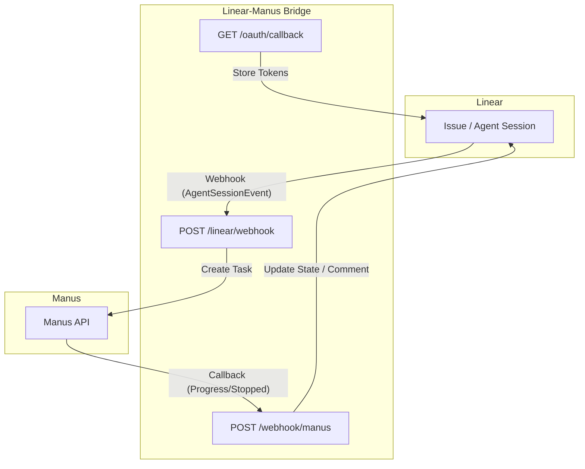

# Linear-Manus Bridge

A lightweight middleware service that connects **Linear** to **Manus**. When a user delegates a Linear issue to the Manus app, the bridge receives a webhook, creates a Manus task with the issue context as the prompt, and updates the Linear issue state and agent session in real time.

---

## 🏗 Architecture



### 🚀 How it works

1.  **Delegation:** A user delegates a Linear issue to the **Manus** app via the agent session UI ("Connect Manus").
2.  **Webhook:** Linear fires an `AgentSessionEvent` webhook (`action: "created"`) to `POST /linear/webhook`.
3.  **Task Creation:** The bridge verifies the signature, retrieves the OAuth token, transitions the issue to **In Progress**, and creates a Manus task.
4.  **Context:** The bridge uses Linear's `promptContext` (pre-formatted title, description, and comments) as the Manus prompt.
5.  **Attachments:** Any URLs or base64-encoded files in the issue description are automatically attached to the Manus task.
6.  **Real-time Updates:**
    *   **Progress:** Manus sends `task_progress` webhooks; the bridge updates a single "Manus Progress" comment in Linear and emits real-time "thoughts" in the agent session UI.
    *   **Completion:** Manus sends `task_stopped` webhooks; the bridge transitions the issue to **Done** (or **Cancelled**), posts the final result, and attaches any output files.

---

## ⚙️ Environment Variables

| Variable | Required | Description |
| :--- | :---: | :--- |
| `LINEAR_CLIENT_ID` | Yes | OAuth App Client ID from Linear Settings. |
| `LINEAR_CLIENT_SECRET` | Yes | OAuth App Client Secret from Linear Settings. |
| `LINEAR_REDIRECT_URI` | Yes | Must match the registered callback (e.g., `https://<domain>/oauth/callback`). |
| `LINEAR_WEBHOOK_SECRET` | Yes | Signing secret from Linear Webhook settings. |
| `MANUS_API_KEY` | Yes | Your API key from the [Manus Dashboard](https://manus.im). |
| `INSTALLATION_STORE_SECRET` | Yes | Random secret for AES-256-GCM encryption of tokens. |
| `SERVICE_BASE_URL` | Yes | Production URL (no trailing slash). Used for webhook signature verification. |
| `DATA_DIR` | Yes | Path to persistent storage (e.g., `/data` on Railway). |
| `MANUS_AGENT_PROFILE` | No | Default: `manus-1.6`. Options: `manus-1.6-lite`, `manus-1.6-max`. |
| `LINEAR_IN_PROGRESS_STATE`| No | Default: `In Progress`. |
| `LINEAR_COMPLETION_STATE` | No | Default: `Done`. |

---

## 💾 Persistent Storage

The bridge uses a persistent filesystem to store encrypted OAuth tokens and task mappings.

| File | Contents |
| :--- | :--- |
| `.installations.enc` | Encrypted OAuth tokens for workspace installations. |
| `.tasks.json` | Mapping of Manus Task IDs to Linear Issue IDs. |
| `.pending-tasks.json` | Temporary store for tasks awaiting user input (e.g., profile selection). |

### Railway Setup
1.  Add a **Volume** in Railway settings (Mount Path: `/data`).
2.  Set `DATA_DIR=/data` in your Variables.

---

## 🛠 Deployment & Setup

### 1. Register Manus Webhook
Register your bridge URL with Manus to receive callbacks:
```bash
curl -X POST https://api.manus.ai/v1/webhooks \
  -H "API_KEY: $MANUS_API_KEY" \
  -H "Content-Type: application/json" \
  -d '{"webhook": {"url": "https://<your-domain>/webhook/manus"}}'
```

### 2. Configure Linear Webhook
In **Linear → Settings → API → Webhooks**:
- **URL:** `https://<your-domain>/linear/webhook`
- **Events:** `Agent session events`

### 3. OAuth Installation
Visit `https://<your-domain>/oauth/install` to authorize the bridge for your workspace. Verify the installation at `/oauth/installations`.

---

## 🔐 Security

-   **Linear (HMAC-SHA256):** Verified using `LINEAR_WEBHOOK_SECRET`.
-   **Manus (RSA-SHA256):** Verified using Manus's public key (fetched and cached from `/v1/webhook/public_key`).
-   **Encryption:** OAuth tokens are encrypted at rest using AES-256-GCM with `INSTALLATION_STORE_SECRET`.

---

## 📝 Advanced Features

### 📎 Attachments
The bridge automatically detects and uploads:
-   **URLs:** Any `https://` links in the description/comments.
-   **Base64 Files:** Use the following block in your Linear issue:
    \```manus-base64 filename=data.csv mime=text/csv
    <base64_content>
    \```

### 🤖 Profile Selection
If a user adds a comment like `/manus profile=manus-1.6-max`, the bridge will use that specific agent profile. If credits are insufficient for a premium profile, it automatically falls back to `manus-1.6-lite`.

---

## ⚖️ Known Limitations
- **Multi-workspace:** While the store supports multiple installations, the current routing logic is optimized for single-workspace deployments.
- **Rate Limits:** Subject to Linear and Manus API rate limits.
