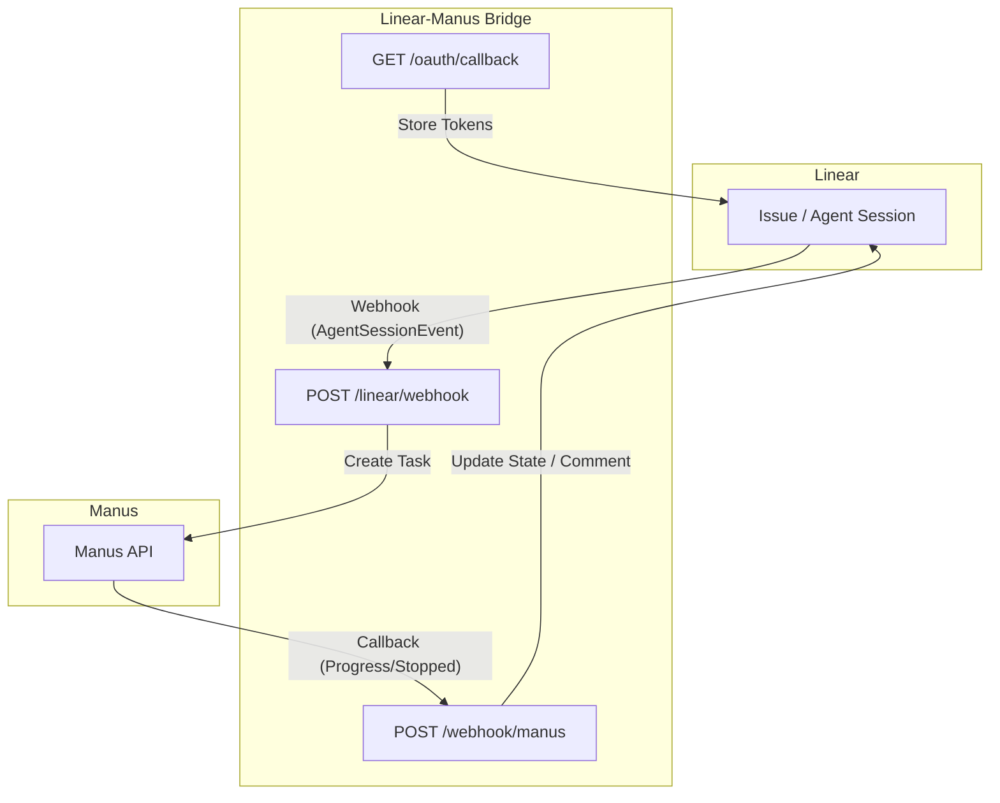

# Linear-Manus Bridge

A lightweight middleware service designed to seamlessly integrate **Linear** with **Manus**. This bridge automates the process of creating Manus tasks from Linear issues and provides real-time updates back to Linear, enhancing collaboration and agent-driven workflows.

When a user delegates a Linear issue to the Manus app, the bridge intercepts the `AgentSessionEvent` webhook, extracts relevant context, creates a Manus task, and then updates the Linear issue's state and agent session with progress and results from Manus.

---

## ✨ Key Features

*   **Automated Task Creation**: Automatically spawns Manus tasks when issues are delegated in Linear.
*   **Real-time Sync**: Updates Linear issue status and comments as Manus progresses.
*   **Context Awareness**: Forwards issue descriptions, comments, and attachments to Manus.
*   **Secure**: Implements HMAC-SHA256 and RSA-SHA256 signature verification for webhooks.
*   **Flexible**: Supports custom agent profiles and workflow state mappings.
*   **Robust Storage**: Encrypted storage for OAuth tokens and persistent task mapping.

---

## 🏗 Architecture

The Linear-Manus Bridge acts as an intermediary, facilitating communication and data flow between Linear and Manus.



### 🚀 How it works

1.  **Delegation**: A user initiates the process by delegating a Linear issue to the **Manus** app, typically via the agent session UI's "Connect Manus" action. This action triggers an `AgentSessionEvent` webhook from Linear [1].
2.  **Webhook Reception**: The bridge receives the `AgentSessionEvent` webhook at `POST /linear/webhook`. It verifies the webhook's signature to ensure authenticity [2].
3.  **Task Creation**: Upon successful verification, the bridge retrieves the necessary OAuth token, transitions the Linear issue to an **In Progress** state, and creates a new Manus task using the Manus API [3].
4.  **Contextual Prompt**: The bridge utilizes Linear's `promptContext` field, which contains a pre-formatted summary of the issue's title, description, and comments, as the prompt for the Manus task [1].
5.  **Attachments**: Any URLs or base64-encoded files embedded within the Linear issue description are automatically extracted and attached to the newly created Manus task [4].
6.  **Real-time Updates**: The bridge maintains real-time synchronization between Manus and Linear:
    *   **Progress**: As Manus processes the task, it sends `task_progress` webhooks to the bridge. The bridge then updates a dedicated "Manus Progress" comment within the Linear issue and emits real-time "thoughts" in the agent session UI [5].
    *   **Completion**: When the Manus task is completed or stopped, Manus sends `task_stopped` webhooks. The bridge updates the Linear issue's state to **Done** (or **Cancelled**), posts the final result as a comment, and attaches any output files generated by Manus [5].

---

## 🚀 Getting Started

### Prerequisites

*   **Node.js**: version 20 or higher.
*   **Linear Account**: With permissions to create OAuth applications and webhooks.
*   **Manus Account**: With an active API key from the [Manus Dashboard](https://manus.im).

### Local Development

1.  **Clone the repository**:
    ```bash
    git clone https://github.com/jon-neher/Linear-Manus-Bridge.git
    cd Linear-Manus-Bridge
    ```

2.  **Install dependencies**:
    ```bash
    npm install
    ```

3.  **Configure environment**:
    Copy `env.example` to `.env` and fill in the required variables.
    ```bash
    cp env.example .env
    ```

4.  **Run the development server**:
    ```bash
    npm run dev
    ```

5.  **Expose locally (optional)**:
    Use a tool like `ngrok` or `localtunnel` to expose your local server to the internet for webhook testing.
    ```bash
    ngrok http 3000
    ```

---

## 🛠 Deployment & Setup

### 1. Persistent Storage & Railway Setup

The bridge utilizes a persistent filesystem to securely store encrypted OAuth tokens and maintain task mappings. This ensures continuity across service restarts.

| File | Contents |
| :--- | :--- |
| `.installations.enc` | Encrypted OAuth tokens for each workspace installation. |
| `.tasks.json` | Mapping of Manus Task IDs to Linear Issue IDs, and associated metadata. |
| `.pending-tasks.json` | Temporary store for tasks awaiting user input (e.g., profile selection). |
| `.manus-webhook.json` | Stores the registered Manus webhook ID for management. |

**Railway Setup (Recommended)**:
1.  Add a **Volume** in your Railway project settings. Set its Mount Path to `/data`.
2.  In your Railway Variables, set `DATA_DIR=/data`.

### 2. Register Manus Webhook

Register your bridge's Manus webhook endpoint with Manus. This is typically done once on service startup, as implemented in `src/services/manusWebhooks.ts`.

```bash
curl -X POST https://api.manus.ai/v1/webhooks \
  -H "API_KEY: $MANUS_API_KEY" \
  -H "Content-Type: application/json" \
  -d '{"webhook": {"url": "https://<your-domain>/webhook/manus"}}'
```

### 3. Configure Linear Webhook

In your Linear workspace, configure a webhook to send `AgentSessionEvent`s to your bridge:

1.  Navigate to **Linear → Settings → API → Webhooks**.
2.  Click "New webhook".
3.  Set the **URL** to `https://<your-domain>/linear/webhook`.
4.  Select `Agent session events` under "Events".
5.  Copy the generated **Signing secret** and set it as `LINEAR_WEBHOOK_SECRET` in your environment variables.

### 4. OAuth Installation

To authorize the bridge for your Linear workspace:

1.  Visit `https://<your-domain>/oauth/install` in your browser.
2.  Follow the Linear OAuth flow to grant the necessary permissions (`read`, `write`, `app:assignable`, `app:mentionable`) [1].
3.  Verify the installation by visiting `https://<your-domain>/oauth/installations`.

---

## ⚙️ Environment Variables

| Variable | Required | Description |
| :--- | :---: | :--- |
| `LINEAR_CLIENT_ID` | Yes | OAuth App Client ID obtained from Linear Settings. |
| `LINEAR_CLIENT_SECRET` | Yes | OAuth App Client Secret obtained from Linear Settings. |
| `LINEAR_REDIRECT_URI` | Yes | The registered callback URL for your Linear OAuth app (e.g., `https://<your-domain>/oauth/callback`). |
| `LINEAR_WEBHOOK_SECRET` | Yes | The signing secret for Linear webhooks, configured in Linear Webhook settings. Used for HMAC-SHA256 verification. |
| `MANUS_API_KEY` | Yes | Your API key from the [Manus Dashboard](https://manus.im). |
| `INSTALLATION_STORE_SECRET` | Yes | A random, strong secret used for AES-256-GCM encryption of OAuth tokens at rest. |
| `SERVICE_BASE_URL` | Yes | The production URL of your deployed bridge service. No trailing slash. |
| `DATA_DIR` | Yes | Path to a persistent storage directory (e.g., `/data` on Railway). |
| `MANUS_API_URL` | No | Base URL for the Manus API. Defaults to `https://api.manus.ai`. |
| `MANUS_AGENT_PROFILE` | No | Default Manus agent profile. Options: `manus-1.6`, `manus-1.6-lite`, `manus-1.6-max`. |
| `LINEAR_IN_PROGRESS_STATE`| No | Linear workflow state for issues being processed. Default: `In Progress`. |
| `LINEAR_COMPLETION_STATE` | No | Linear workflow state for completed issues. Default: `Done`. |
| `LINEAR_FAILURE_STATE` | No | Linear workflow state for failed tasks. Default: `Cancelled`. |

---

## 📂 Project Structure

```text
├── src/
│   ├── routes/          # Express route handlers (Linear, Manus, OAuth)
│   ├── services/        # Business logic (API clients, auth, storage)
│   ├── __tests__/       # Test suite (Vitest)
│   └── index.ts         # Entry point & app configuration
├── package.json         # Dependencies & scripts
├── tsconfig.json        # TypeScript configuration
└── vitest.config.ts     # Vitest configuration
```

---

## 📝 Advanced Features

### 📎 Attachments

The bridge intelligently handles attachments to provide comprehensive context to Manus tasks:

*   **URLs**: Any `https://` links found within the Linear issue description or comments are automatically extracted and passed to Manus as URL attachments [4].
*   **Base64 Files**: Users can embed base64-encoded files directly into Linear issue descriptions using a specific Markdown block:

    ```markdown
    ```manus-base64 filename=data.csv mime=text/csv
    <base64_content>
    ```
    ```

### 🤖 Profile Selection

Users can specify a particular Manus agent profile for a task by adding a comment to the Linear issue. For example, a comment like `/manus profile=manus-1.6-max` will instruct the bridge to use the `manus-1.6-max` profile.

---

## 🔐 Security

*   **Linear Webhook Verification**: Uses HMAC-SHA256 with the `LINEAR_WEBHOOK_SECRET` to verify incoming payloads [2].
*   **Manus Webhook Verification**: Uses RSA-SHA256 signatures with cached public keys from Manus [6].
*   **Token Encryption**: Linear OAuth tokens are encrypted at rest using AES-256-GCM with the `INSTALLATION_STORE_SECRET`.

---

## ⚖️ Known Limitations

*   **Multi-workspace**: While the storage supports multiple installations, the routing is optimized for single-workspace deployments.
*   **Task Store**: The current `taskStore` implementation is in-memory and will be cleared on service restart.

---

## 🤝 Contributing

Contributions are welcome! Please feel free to submit a Pull Request. For major changes, please open an issue first to discuss what you would like to change.

1. Fork the Project
2. Create your Feature Branch (`git checkout -b feature/AmazingFeature`)
3. Commit your Changes (`git commit -m 'Add some AmazingFeature'`)
4. Push to the Branch (`git push origin feature/AmazingFeature`)
5. Open a Pull Request

---

## References

[1] Linear Developers. "Getting Started". *Linear*. Available at: https://linear.app/developers/agents
[2] Linear Developers. "Developing the Agent Interaction". *Linear*. Available at: https://linear.app/developers/agent-interaction
[3] Manus API. "Create Task". *Manus*. Available at: https://open.manus.im/docs/api-reference/create-task
[4] `src/services/manusAttachments.ts` in `jon-neher/Linear-Manus-Bridge` repository.
[5] `src/routes/webhook.ts` in `jon-neher/Linear-Manus-Bridge` repository.
[6] Manus API. "Security". *Manus*. Available at: https://open.manus.im/docs/webhooks/security
