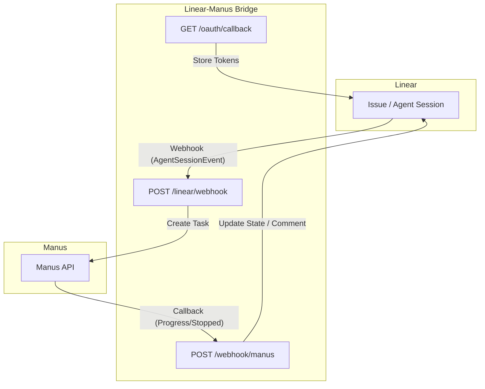

# Linear-Manus Bridge

A lightweight middleware service designed to seamlessly integrate **Linear** with **Manus**. This bridge automates the process of creating Manus tasks from Linear issues and provides real-time updates back to Linear, enhancing collaboration and agent-driven workflows.

When a user delegates a Linear issue to the Manus app, the bridge intercepts the `AgentSessionEvent` webhook, extracts relevant context, creates a Manus task, and then updates the Linear issue's state and agent session with progress and results from Manus.

---

## 🏗 Architecture

The Linear-Manus Bridge acts as an intermediary, facilitating communication and data flow between Linear and Manus. The architecture is designed for robustness and real-time interaction.



### 🚀 How it works

1.  **Delegation**: A user initiates the process by delegating a Linear issue to the **Manus** app, typically via the agent session UI's "Connect Manus" action. This action triggers an `AgentSessionEvent` webhook from Linear [1].
2.  **Webhook Reception**: The bridge receives the `AgentSessionEvent` webhook at `POST /linear/webhook`. It verifies the webhook's signature to ensure authenticity [2].
3.  **Task Creation**: Upon successful verification, the bridge retrieves the necessary OAuth token, transitions the Linear issue to an **In Progress** state, and creates a new Manus task using the Manus API [3].
4.  **Contextual Prompt**: The bridge utilizes Linear's `promptContext` field, which contains a pre-formatted summary of the issue's title, description, and comments, as the prompt for the Manus task [1].
5.  **Attachments**: Any URLs or base64-encoded files embedded within the Linear issue description are automatically extracted and attached to the newly created Manus task [4].
6.  **Real-time Updates**: The bridge maintains real-time synchronization between Manus and Linear:
    *   **Progress**: As Manus processes the task, it sends `task_progress` webhooks to the bridge. The bridge then updates a dedicated "Manus Progress" comment within the Linear issue and emits real-time "thoughts" in the agent session UI [5].
    *   **Completion**: When the Manus task is completed or stopped, Manus sends `task_stopped` webhooks. The bridge updates the Linear issue's state to **Done** (or **Cancelled**), posts the final result as a comment, and attaches any output files generated by Manus [5].

---

## ⚙️ Environment Variables

The following environment variables are required for the Linear-Manus Bridge to function correctly. These can be configured in your deployment environment (e.g., `.env` file, Railway variables).

| Variable | Required | Description |
| :--- | :---: | :--- |
| `LINEAR_CLIENT_ID` | Yes | OAuth App Client ID obtained from Linear Settings. |
| `LINEAR_CLIENT_SECRET` | Yes | OAuth App Client Secret obtained from Linear Settings. |
| `LINEAR_REDIRECT_URI` | Yes | The registered callback URL for your Linear OAuth app (e.g., `https://<your-domain>/oauth/callback`). |
| `LINEAR_WEBHOOK_SECRET` | Yes | The signing secret for Linear webhooks, configured in Linear Webhook settings. Used for HMAC-SHA256 verification. |
| `MANUS_API_KEY` | Yes | Your API key from the [Manus Dashboard](https://manus.im). |
| `INSTALLATION_STORE_SECRET` | Yes | A random, strong secret used for AES-256-GCM encryption of OAuth tokens at rest. |
| `SERVICE_BASE_URL` | Yes | The production URL of your deployed bridge service (e.g., `https://linear-manus-bridge.example.com`). No trailing slash. Used for Manus webhook signature verification and constructing callback URLs. |
| `DATA_DIR` | Yes | Path to a persistent storage directory (e.g., `/data` on Railway) for storing encrypted OAuth tokens and task mappings. |
| `MANUS_API_URL` | No | Base URL for the Manus API. Defaults to `https://api.manus.ai`. |
| `MANUS_AGENT_PROFILE` | No | Default Manus agent profile to use. Options: `manus-1.6` (default), `manus-1.6-lite`, `manus-1.6-max`. |
| `LINEAR_IN_PROGRESS_STATE`| No | Name of the Linear workflow state for issues being processed by Manus. Default: `In Progress`. |
| `LINEAR_COMPLETION_STATE` | No | Name of the Linear workflow state for issues completed by Manus. Default: `Done`. |
| `LINEAR_FAILURE_STATE` | No | Name of the Linear workflow state for issues where Manus task failed. Default: `Cancelled`. |
| `LINEAR_NEEDS_INPUT_STATE` | No | Name of the Linear workflow state for issues where Manus requires user input. Default: `Needs Input`. |

---

## 💾 Persistent Storage

The bridge utilizes a persistent filesystem to securely store encrypted OAuth tokens and maintain task mappings between Linear and Manus. This ensures continuity across service restarts and deployments.

| File | Contents |
| :--- | :--- |
| `.installations.enc` | Encrypted OAuth tokens for each workspace installation. |
| `.tasks.json` | Mapping of Manus Task IDs to Linear Issue IDs, and associated metadata. |
| `.pending-tasks.json` | Temporary store for tasks awaiting user input (e.g., profile selection). |
| `.manus-webhook.json` | Stores the registered Manus webhook ID for management. |

### Railway Setup

For deployments on platforms like Railway that offer ephemeral filesystems, it is crucial to configure persistent storage:

1.  Add a **Volume** in your Railway project settings. Set its Mount Path to `/data`.
2.  In your Railway Variables, set `DATA_DIR=/data`.

---

## 🛠 Deployment & Setup

Follow these steps to deploy and set up the Linear-Manus Bridge:

### 1. Register Manus Webhook

Register your bridge's Manus webhook endpoint with Manus to receive real-time task updates. This is typically done once on service startup, as implemented in `src/services/manusWebhooks.ts`.

```bash
curl -X POST https://api.manus.ai/v1/webhooks \
  -H "API_KEY: $MANUS_API_KEY" \
  -H "Content-Type: application/json" \
  -d '{"webhook": {"url": "https://<your-domain>/webhook/manus"}}'
```

### 2. Configure Linear Webhook

In your Linear workspace, configure a webhook to send `AgentSessionEvent`s to your bridge:

1.  Navigate to **Linear → Settings → API → Webhooks**.
2.  Click "New webhook".
3.  Set the **URL** to `https://<your-domain>/linear/webhook`.
4.  Select `Agent session events` under "Events".
5.  Copy the generated **Signing secret** and set it as `LINEAR_WEBHOOK_SECRET` in your environment variables.

### 3. OAuth Installation

To authorize the bridge for your Linear workspace:

1.  Visit `https://<your-domain>/oauth/install` in your browser.
2.  Follow the Linear OAuth flow to grant the necessary permissions (`read`, `write`, `app:assignable`, `app:mentionable`) [1].
3.  Verify the installation by visiting `https://<your-domain>/oauth/installations`.

---

## 🔐 Security

The Linear-Manus Bridge implements several security measures to protect data and ensure the integrity of communications:

*   **Linear Webhook Verification (HMAC-SHA256)**: Incoming webhooks from Linear are verified using the `LINEAR_WEBHOOK_SECRET` and an HMAC-SHA256 algorithm. This ensures that webhook payloads are authentic and have not been tampered with [2].
*   **Manus Webhook Verification (RSA-SHA256)**: Webhooks received from Manus are verified using RSA-SHA256 signatures. The bridge fetches and caches Manus's public key from `/v1/webhook/public_key` to validate the `X-Webhook-Signature` and `X-Webhook-Timestamp` headers [6].
*   **OAuth Token Encryption**: Linear OAuth tokens are sensitive credentials. The bridge encrypts these tokens at rest using AES-256-GCM with a randomly generated `INSTALLATION_STORE_SECRET`, providing robust protection against unauthorized access.

---

## 📝 Advanced Features

### 📎 Attachments

The bridge intelligently handles attachments to provide comprehensive context to Manus tasks:

*   **URLs**: Any `https://` links found within the Linear issue description or comments are automatically extracted and passed to Manus as URL attachments [4].
*   **Base64 Files**: Users can embed base64-encoded files directly into Linear issue descriptions using a specific Markdown block. The bridge detects and uploads these files to Manus:

    ```markdown
    ```manus-base64 filename=data.csv mime=text/csv
    <base64_content>
    ```
    ```

    The `filename` and `mime` (or `mimetype`) parameters are optional but recommended for proper file handling.

### 🤖 Profile Selection

Users can specify a particular Manus agent profile for a task by adding a comment to the Linear issue. For example, a comment like `/manus profile=manus-1.6-max` will instruct the bridge to use the `manus-1.6-max` profile. If the selected premium profile has insufficient credits, the system automatically falls back to `manus-1.6-lite` [2].

---

## ⚖️ Known Limitations

*   **Multi-workspace**: While the underlying storage mechanism supports multiple workspace installations, the current routing logic is primarily optimized for single-workspace deployments.
*   **Rate Limits**: Operations are subject to the API rate limits imposed by both Linear and Manus.

---

## References

[1] Linear Developers. "Getting Started". *Linear*. Available at: https://linear.app/developers/agents
[2] Linear Developers. "Developing the Agent Interaction". *Linear*. Available at: https://linear.app/developers/agent-interaction
[3] Manus API. "Create Task". *Manus*. Available at: https://open.manus.im/docs/api-reference/create-task
[4] `src/services/manusAttachments.ts` in `jon-neher/Linear-Manus-Bridge` repository.
[5] `src/routes/webhook.ts` in `jon-neher/Linear-Manus-Bridge` repository.
[6] Manus API. "Security". *Manus*. Available at: https://open.manus.im/docs/webhooks/security
